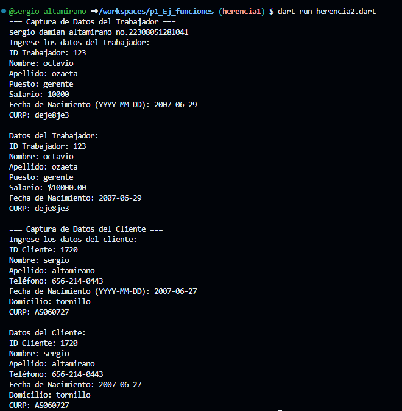

crear una clase Trabajador con los atributos (id_trabajador, nombre, apellido, puesto, salario, fecha de nacimiento y curp) con una función capturadatos(), con interacción de interfaz de usuario. crear la clase DatosTrabajador con herencia Trabajador y una función mostrardatos() en lenguaje dart.

crear una clase Cliente con los atributos (id_cliente, nombre, apellido, telefono, fecha de nacimiento, domicilio y curp) con una función capturadatos(), con interacción de interfaz de usuario. crear la clase DatosCliente con herencia Cliente y una función mostrardatos() en lenguaje dart.

