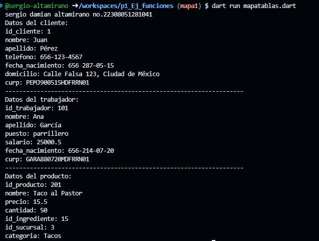

1. crear map <string, dinamic> clientes con los siguientes key, id_cliente, nombre, apellido, telefono, fecha de nacimiento, domicilio y curp. y mostrar los datos con un ford each. lenguaje dart

2. crear map <string, dinamic> trabajadores con los siguientes key, id_trabajador, nombre, apellido, puesto, salario, fecha de nacimiento y curp. y mostrar los datos con un ford each. lenguaje dart

3. crear map <string, dinamic> producto con los siguientes key, id_producto, nombre, precio, cantidad, id_inghrediente, id_sucursal y categoria. y mostrar los datos con un ford each. lenguaje dart

